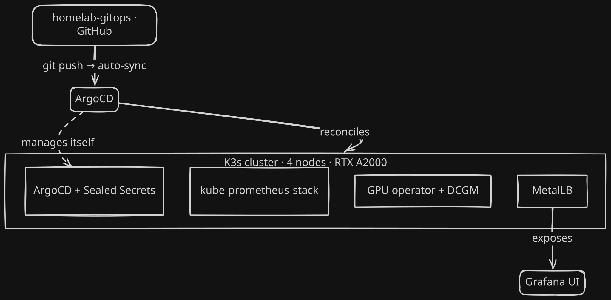

# homelab-gitops

Source of truth for a 4-node K3s homelab cluster (3 Proxmox VMs + 1 GPU bare-metal node). ArgoCD reconciles the entire cluster from this repo — including ArgoCD itself. Every change — config, upgrades, secret rotation — is a git commit; ArgoCD applies it automatically within minutes.

## What this demonstrates

- **GitOps from the ground up** — app-of-apps pattern (`root` watches `apps/`, child apps own every layer), auto-sync + self-heal, ServerSideApply for large CRDs
- **Self-managed control plane** — ArgoCD and Sealed Secrets reconcile their own existence from Git (adopted from hand-installed bootstrap via verified no-op diff)
- **Mixed-source apps** — raw manifests, vendored upstream installs pinned by version, and Helm charts fetched directly from chart repos with inline values
- **Secrets in a public repo** — Sealed Secrets: ciphertext in Git, decryption keys never leave the cluster
- **Cheap disaster recovery** — rebuild = install ArgoCD, apply two bootstrap objects, wait

## Design decisions

| Decision | Why | Tradeoff accepted |
|----------|-----|-------------------|
| self-heal OFF for the `argocd`/`sealed-secrets` apps | self-managing ArgoCD with self-heal is a known footgun — sync fights its own pod rolls | manual `--refresh` if those apps drift |
| Vendored pinned manifests instead of Helm for the control plane | adoption was a provable zero-drift no-op; upgrades = swap in the new tag's file | no chart values conveniences |
| `skipCrds: true` + one-time `kubectl apply --server-side` for kps/GPU-operator CRDs | several CRDs exceed ArgoCD's 256KB client-side apply annotation limit | CRDs bootstrapped outside Git |
| Admission webhooks disabled on prometheus-operator | cert-gen jobs misbehave under ArgoCD; validation is optional at homelab scale | no admission-time rule validation |
| Loki dropped after a trial | single-binary + retention + gateway complexity outweighed value at this scale | no log aggregation |
| Deploy key (read-only, repo-scoped) over a PAT | ArgoCD needs exactly one repo, nothing more | key rotation = manual bootstrap step |

## Cluster at a glance

| | |
|---|---|
| Cluster | K3s v1.36 · 1 control-plane + 3 workers (2 Proxmox VMs + Dell bare-metal GPU node, RTX A2000) |
| GitOps | ArgoCD v3.4.5 (non-HA), app-of-apps, 8 Applications |
| Observability | kube-prometheus-stack 87.21.0 (Prometheus 14d retention, Grafana via LoadBalancer, Alertmanager) + NVIDIA DCGM exporter/ServiceMonitor/dashboard |
| Load balancer | MetalLB L2 |

## Bootstrap & recovery

ArgoCD can't manage its own first install, so a minimal manual layer bootstraps the loop: install ArgoCD once, apply the repo-access Secret (read-only GitHub deploy key — the one manifest deliberately not in Git) and [`apps/root.yaml`](apps/root.yaml). From then on `root` reconciles everything, including ArgoCD and Sealed Secrets themselves. kube-prometheus-stack CRDs are applied once with server-side apply (see design decisions). Disaster recovery is the same procedure — the cluster rebuilds from Git.

## Current state (2026-08-26)

| App | Source | Wave | Manages |
|-----|--------|------|---------|
| `root` | `apps/` | — | all child Applications (app-of-apps) |
| `argocd` | `argocd/` (vendored v3.4.5) | −2 | ArgoCD itself |
| `sealed-secrets` | `sealed-secrets/` (vendored v0.38.4) | −1 | Sealed Secrets controller |
| `observability-secrets` | `observability/` | −1 | sealed Grafana admin password |
| `kube-prometheus-stack` | chart 87.21.0 | 0 | Prometheus + Grafana + Alertmanager + node-exporter + kube-state-metrics |
| `metallb-config` | `metallb/` | 0 | IPAddressPool + L2Advertisement |
| `gpu-operator` | chart v26.3.3 | 0 | NVIDIA GPU Operator (host driver, operator-managed toolkit) |
| `gpu-observability` | `gpu/` | 1 | DCGM ServiceMonitor + Grafana dashboard |
